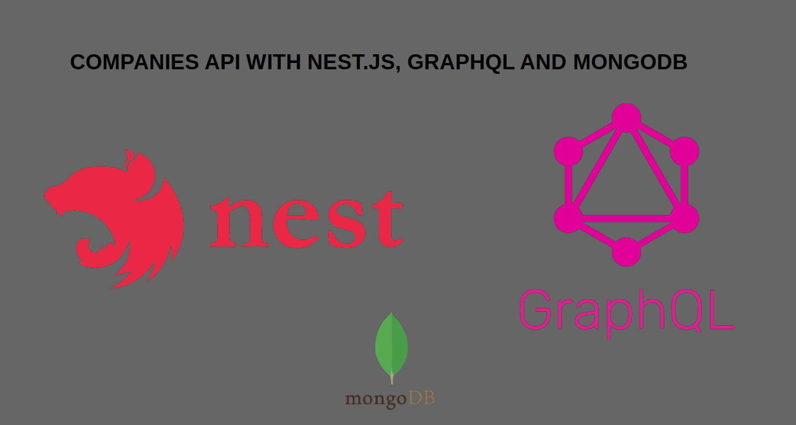

<p align="center">
  <a target="blank"></a>
</p>


## Development of an API for ListoApp technical skills testing using the following technologies:
  - Nest.JS
  - MongoDB
  - TypeScript
  - GraphQL

## This API allows:
  - Create a company in database
  - Update a company by ID
  - See all companies registered in the database
  - View a company by its ID.

It has Mongo ID validation to prevent an incorrect ID from being entered.

Validation in the type of fields.

There are required fields and non-required fields, the following list shows the fields it supports:	
  - company_name: string; (required, cannot be empty)
  - address: string; (required, cannot be empty)
  - phone_number: string; (required, cannot be empty)
  - emial: string; (it is required, it cannot be empty, it must be a valid email)
  - state: string; (required, cannot be empty)
  - city: string; (required, cannot be empty)
  - zip_code: number; (optional, can be empty)
  - website: string; (optional, can be empty)
  - industry: string; (required, cannot be empty)

 

## Settings
  1. Clone the repository.
  2. Rename the ```.env.example``` to ```.env```.
  3. Configure environment variables.

## Installation

```bash
$ npm install
```

## Execute

```bash
# development
$ npm run start

# watch mode
$ npm run start:dev

# production mode
$ npm run start:prod
```

## Go to the URL

```bash
$ http://localhost:3000/graphql
```

## Query and Mutation Examples

### getCompanies
```bash
{
  getCompanies {
  	_id
    company_name
    address
    phone_number
    emial
    state 
    city
    zip_code
    website
    industry
    createAt
    
  }
}
```
### getOneCompany
```bash
{
  getOneCompany(_id: "65e258c18e4b7515a448b6cd"){
    _id
    company_name
    address
    phone_number
    emial
    state 
    city
    zip_code
    website
    industry
    createAt
  }
}
```
### createCompany
```bash
mutation {
  createCompany(createCompayInput: {
    company_name: "Sura Bank",
    address: "Cra 126 # 45-12",
    phone_number: "96321478",
    emial: "contacto@sura.com",
    state: "Cundinamarca",
    city: "Bogotá",
    zip_code: 10021256,
    website: "www.surabank.com",
    industry: "Financiero"
  }){
    company_name
    address
    phone_number
    emial
    state 
    city
    zip_code
    website
    industry
    createAt
    
  }
}
```
### updateCompany
```bash
mutation {
  
  updateCompany( updateCompayInput: {
    _id: "65e25a438e4b7515a448b6da"
   
   	company_name: "SoftServices"
    
  }){
    _id
    company_name
    address
    phone_number
    emial
    state 
    city
    zip_code
    website
    industry
    createAt
  }
}
```
### deleteCompany
```bash
mutation {
  deleteCompany(_id: "65e26190cae6c4785233a2f0"){
    _id
  }
}
```
